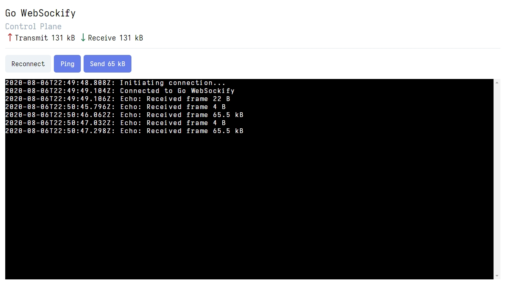

# Go WebSockify
> RFC 6455 compliant TCP and Unix socket proxy to WebSockets.

Go WebSockify is a pure Go implementation of [novnc/websockify](https://github.com/novnc/websockify) TCP/Unix to WebSocket proxy with improved connection handling. Runs on Linux, Windows and MacOS.

## Table of Contents
- [Installation](#installation)
  - [Build from source](#build-from-source)
- [Usage](#usage)
- [Development](#development)
  - [Dependencies](#dependencies)
  - [Development control plane](#development-control-plane)
  - [Screenshots](#screenshots)
- [License](#license)

## Installation

### Build from source
```shell
$ git clone https://github.com/msquee/go-websockify.git
$ cd go-websockify
$ make
```

## Usage
```shell
$ go-websockify --help
Starts a TCP/Unix to WebSocket proxy.

Usage:
  go-websockify [flags]

Flags:
      --bind-addr string     bind address (default "0.0.0.0:8080")
      --buffer int           buffer size (default 65536)
  -D, --daemon               run Go WebSockify as daemon
      --echo                 run sidecar echo server
  -h, --help                 help for go-websockify
      --remote-addr string   remote address (default "127.0.0.1:3000")
  -v, --version              print Go WebSockify version
```

## Development

### Dependencies
- [Go 1.14](https://golang.org/doc/devel/release.html#go1.14)
- [Yarn](https://yarnpkg.com/getting-started/install)
- [Modd](https://github.com/cortesi/modd) is used for a seamless development experience, simply run `modd` in the root directory of this project to start the development environment.

### Development control plane
`go-websockify` has a side car client application for testing. If you want to run this during development you'll need every dependency below

A simple control plane for development is available at: http://127.0.0.1:1234. For the frontend to connect you have to pass `--echo` as a command line flag. **This is done for you if you're using Modd.**

### Screenshots


> The control plane is not included with binary distributions.

## Contributing
Both pull requests and issues are welcome on [GitHub](https://github.com/msquee/go-websockify). No set rules for contributing, just keep it clean.

## License
This project is licensed under the terms of the [MIT License](https://github.com/msquee/go-websockify/blob/master/LICENSE.md).
