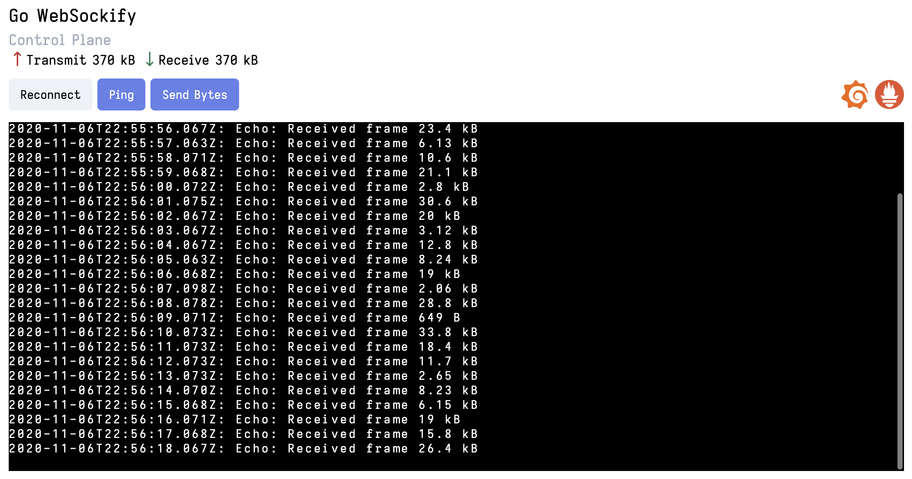

# Go WebSockify
> RFC 6455 compliant TCP to WebSocket proxy.

Go WebSockify is a pure Go implementation of [novnc/websockify](https://github.com/novnc/websockify) TCP to WebSocket proxy with improved connection handling. Runs on Linux, Windows and MacOS.

## Table of Contents
- [Installation](#installation)
  - [Build from source](#build-from-source)
- [Features](#features)
- [Use Cases](#use-cases)
- [Usage](#usage)
- [Development](#development)
  - [Dependencies](#dependencies)
  - [Development environment](#development-environment)
  - [Control plane](#control-plane)
  - [Docker](#docker)
  - [Screenshots](#screenshots)
- [Prometheus Metrics](#prometheus-metrics)
- [Roadmap](#roadmap)
- [Contributing](#contributing)
- [License](#license)

## Installation

### Build from source
```shell
$ git clone https://github.com/msquee/go-websockify.git
$ cd go-websockify
$ make
```

## Features
- Runs in user space.
- Proxy any TCP connection to a WebSocket connection.
- `go-websockify` can be ran as a daemon by passing the command line flag `-D` or `--daemon` to run in the background.

## Use Cases
The most common use case for `go-websockify` is alongside [novnc](https://github.com/novnc) to enable fast virtual desktop experiences in the browser. 

## Usage
```
$ go-websockify --help
Starts a TCP to WebSocket proxy.

Usage:
  go-websockify [flags]

Flags:
      --bind-addr string     bind address (default "0.0.0.0:8080")
      --buffer int           buffer size (default 65536)
  -D, --daemon               run as daemon
      --echo                 sidecar echo server
  -h, --help                 help for go-websockify
      --path string          url path clients connect to (default "/websockify")
      --remote-addr string   remote address (default "127.0.0.1:1984")
  -v, --version              print version
```

## Development

### Dependencies
- [Go 1.14](https://golang.org/doc/devel/release.html#go1.14)
- [Docker](https://docs.docker.com/get-docker/)
- [Yarn](https://yarnpkg.com/getting-started/install)
- [Modd](https://github.com/cortesi/modd)

### Development environment
[Modd](https://github.com/cortesi/modd) is used for a seamless development experience and once installed simply run the command `modd` in the root directory of this project to start the development environment.

### Control plane
> You don't need to do this if you use the provided Docker environment.

`go-websockify` has a simple JavaScript based frontend control plane for development and is available at http://127.0.0.1:1234

To start the control plane run:
```shell
$ cd client
$ yarn install
$ yarn dev
```

> For the frontend to automatically connect to Go WebSockify you have to pass `--echo` as a command line flag to `go-websockify`. **This is done for you if you're using Docker or Modd.**

### Docker
A batteries included Docker environment is included with this repository to show off Go WebSockify in a psuedo production environment.

**Docker environment features:**
- Prometheus
- Grafana with preconfigured dashboard
- Go WebSockify and Control Plane
- TCP Echo Server

|IP|Description|
--|--
|http://127.0.0.1:1234|Control Plane|
|http://127.0.0.1:8080|Go WebSockify|
|http://127.0.0.1:1984|TCP Echo Server|
|http://127.0.0.1:3000|Grafana|
|http://127.0.0.1:9090|Prometheus|

To start the Docker environment run:
```shell
$ docker-compose up
```

> Grafana login is `admin/admin`

### Screenshots


> The control plane is **not** included with binary distributions.

## Prometheus Metrics


Go WebSockify exports the following Prometheus metrics at `/metrics`:
- go_websockify_websocket_bytes_tx_total
- go_websockify_websocket_bytes_rx_total
- go_websockify_websocket_connections_active
- go_websockify_tcp_connections_active

## Roadmap
- [ ] Support TLS on WebSocket connections.
- [ ] Support authenticating WebSocket connections through a plugin system (https://github.com/traefik/yaegi).
- [ ] Support for proxying UNIX sockets to WebSockets.
- [ ] Support backend TCP connection reuse.
- [ ] Wrapping any program with the `LD_PRELOAD` trick to catch `bind()` system calls. See: https://jvns.ca/blog/2014/11/27/ld-preload-is-super-fun-and-easy/.

## Contributing
Both pull requests and issues are welcome on [GitHub](https://github.com/msquee/go-websockify). No set rules for contributing, just keep it clean.

## License
This project is licensed under the terms of the [MIT License](https://github.com/msquee/go-websockify/blob/master/LICENSE.md).
